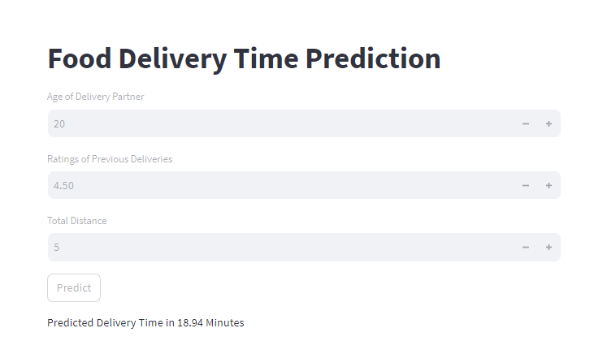

# Food Delivery Time Prediction App

This is a simple Streamlit app that utilizes a trained machine learning model to predict the estimated delivery time for food orders based on certain input parameters.



## Getting Started

To run this Streamlit app and predict delivery time:

1. Clone or download this repository to your local machine.
2. Make sure you have the required dependencies installed. You can install them using the following command:
   
```bash
   pip install streamlit tensorflow numpy
```

3. Place your trained Keras model (saved in `.h5` format) in the same directory as the `app.py` file.

4. Open a terminal or command prompt, navigate to the directory containing the `app.py` file, and run the app using the following command:
   
   ```bash
   streamlit run app.py
   ```

5. The Streamlit app will launch in your web browser, allowing you to input the delivery partner's age, ratings, and total distance to predict the delivery time.

## App Usage

1. Upon launching the app, you will be presented with input fields to provide the following information:
   - Age of the Delivery Partner
   - Ratings of Previous Deliveries (between 0.0 and 5.0)
   - Total Distance (in kilometers)

2. After providing the input, click the "Predict" button.

3. The app will use the trained machine learning model to predict the estimated delivery time in minutes based on the provided input parameters.

## Note

- The provided `app.py` assumes that you have a trained Keras model saved as `my_trained_model.h5` in the same directory. Make sure to adjust the model path if your model has a different filename or location.

- This app is meant to provide a simple demonstration of using a trained model for prediction. You can customize and enhance the app's appearance, functionality, and error handling based on your requirements.